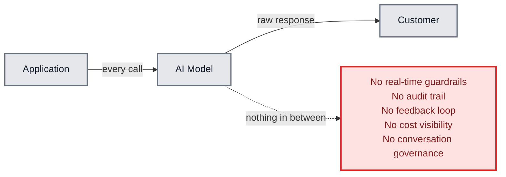
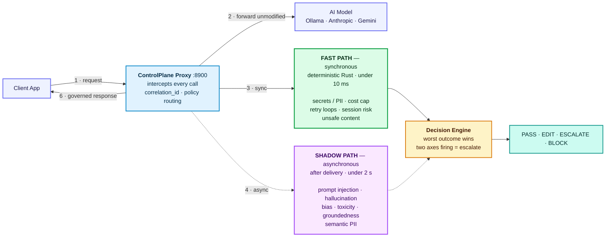
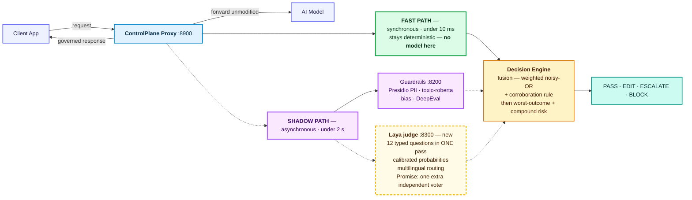
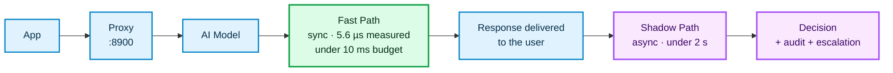
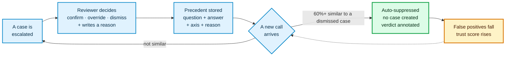
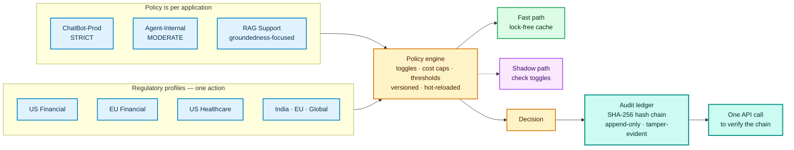
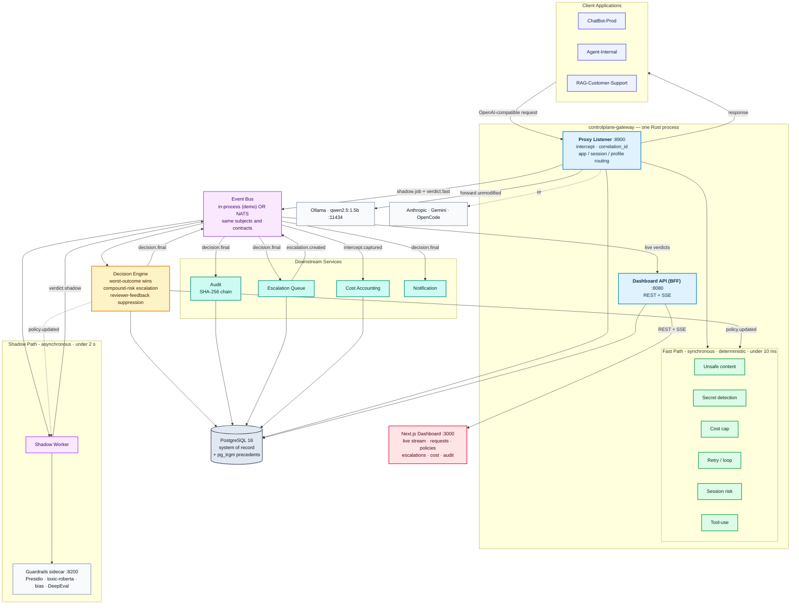

# Architecture Diagrams for the Deck

> **How to use this file:** one **simple** diagram per presentation slide — nothing here
> needs more than ~10 boxes, because you have to explain every box out loud. Render the
> one you need at **3× and export SVG**, drop it into that slide, and read the
> *"How to explain it"* line underneath it.
>
> **Slide order matches `docs/original/presentation-script.md`** (8 slides, 4:30).
>
> - `§1` → **Slide 3** — the main architecture slide (the one diagram you must nail)
> - `§2` → **Slide 3 (variant)** — the same picture **with Laya**, for the "what's next" beat
> - `§3` → **Slide 4** — the demo, as a simple request flow
> - `§4` → **Slide 5** — the feedback loop
> - `§5` → **Slide 6** — governance, policies and audit
> - `§6` → **Backup slide** — the full detailed architecture (appendix only; do **not**
>   put this on a slide you have to narrate)
> - `§7` → rendering tips + a consistency checklist so the deck never contradicts itself

---
## 0. Slide 2 — the problem, in three boxes

The whole point of this slide is the **empty space in the middle**. Draw it red and leave
it bare — the absence is the product opportunity.

**How to explain it (15 s):**

> "This is the entire pipeline today: the app calls the model, the model answers, the
> customer gets it. There is **nothing between the model and the user**. No guardrails in
> real time, no audit trail, no cost visibility, no memory of the conversation — and no way
> to learn from a mistake. That empty space is where ControlPlane lives."

---

## 1. Slide 3 — what we built (THE diagram)

Seven boxes. Four connections that matter. This is the slide you stand on for 45 seconds.

**How to explain it (45 s):**

> "ControlPlane is a reverse proxy. The app points at us instead of the model. We forward
> the request **unmodified** — we are not a model and we do not edit requests.
>
> Then we inspect the response on **two paths, not one**. The **fast path** runs
> synchronously, before the response reaches the user — deterministic Rust, under ten
> milliseconds. The **shadow path** runs asynchronously, after delivery — the expensive
> checks, so the user never waits for them.
>
> Both feed the decision engine, which returns one of four outcomes: pass, edit, escalate,
> or block. And if ControlPlane itself errors, we **fail open** — traffic passes through
> untouched."

**Colour key for the audience:** green = synchronous, before the user sees anything.
Purple = asynchronous, after delivery. Amber = the decision. Teal = the outcome.

---

## 2. Slide 3 variant — the same picture **with Laya** (`TARGET`)

Only **three things change**, and they are drawn dashed. Use this as the "what's next"
beat, or in the appendix. Never present Laya as shipped — say it is planned.

**How to explain it (20 s):**

> "Three things are new, and I've drawn them dashed because they are **planned, not
> shipped**. Laya is a small non-autoregressive decision model — you give it typed
> questions and it answers with **calibrated probabilities** in one forward pass. It joins
> the shadow panel as **one more independent voter** for the fuzzy checks: re-identification,
> hallucination, bias, injection.
>
> Two things to notice. The **fast path does not change** — we will never put a 33 ms model
> in a 10 ms budget. And Laya never makes the decision — it produces scores; our thresholds
> still decide. That is what keeps it a governance layer and not a black box."

**Why it makes us better (if asked):** it is an *ensemble* — each check keeps the engine
that is best for it (Presidio for PII spans, toxic-roberta for toxicity, regex for known
injection patterns) and Laya adds calibrated judgment and multilingual coverage. We measure
the gain by ablation on our own reviewer-labelled data — see
`docs/analysis/laya-integration-plan.md`.

---

## 3. Slide 4 — the demo, as a simple request flow

The point of this slide is **the horizontal line**: everything above it the user waits for;
everything below it they do not. Put the three demo scenarios (`PASS`, `EDIT`, `ESCALATE`)
as three chips under the final box.

**How to explain it (20 s):**

> "Watch where the user's clock stops. The fast path is **synchronous** — secrets, PII,
> cost caps, unsafe content, all in microseconds, before the response is delivered. The
> moment the response reaches the user, their wait is over. Everything after this line —
> injection, hallucination, bias, re-identification — runs **after** delivery. Expensive
> checks, zero latency cost."

**Then run the three scenarios** (from the demo script), and for each one point at the
outcome chip:

| Demo | What fires | Where | Outcome |
|---|---|---|---|
| "What is 2+2?" | nothing | — | **PASS** |
| Response contains an AWS key | regex + entropy | Fast path | **EDIT** (key redacted) |
| "Ignore all previous instructions..." | 3-layer injection | Shadow path | **ESCALATE** |

---

## 4. Slide 5 — the feedback loop (the differentiator)

One loop. Four boxes. This is the slide to slow down on.

**How to explain it (40 s):**

> "Every other governance tool does the same thing: detect, flag, move on. We do something
> none of them do — **we learn from the reviewer**.
>
> When a reviewer dismisses a false positive, we store the whole context: the question, the
> answer, the axis, and their reason. Then, at **two layers**, a future call is checked
> against that precedent — we don't create the escalation case at all, and we downgrade the
> verdict. The verdict is annotated so the audit trail shows *why*: 'learned — a 82%-similar
> past case was dismissed'.
>
> No retraining. And it is measurable: false-positive rate trends down, trust score trends
> up. The system literally gets better every time a human makes a decision."

---

## 5. Slide 6 — governance, policies and audit

Two ideas only: **per-app policies** on the left, **tamper-evident audit** on the right.

**How to explain it (25 s):**

> "Governance is **per application**. A customer-facing chatbot is strict; an internal
> copilot is moderate; a RAG tool is groundedness-focused. Change a toggle and it
> hot-reloads into both paths immediately.
>
> And six regulatory profiles — US Financial, EU, Healthcare, India, EU General, Global —
> so switching compliance posture takes **seconds, not sprints**.
>
> Finally, every single decision is written to a SHA-256 hash chain. Append-only: no record
> can be edited or deleted. One API call verifies the whole chain. That is what regulators
> ask for."

---

## 6. Backup slide — full detailed architecture (appendix only)

Keep this in the deck's **appendix**, for Q&A ("can we see the whole thing?"). Do not
narrate it — it has too many boxes to talk through in 4:30. It exists so a technical judge
can see the real service topology.

**One-line answer if a judge points at it:** *"Every box is a crate in one Rust workspace,
communicating over the event bus — the same subjects and contracts whether the bus is
in-process for the demo or NATS in production. The proxy never blocks on any of them."*

---

## 7. Rendering tips and consistency checklist

### 7.1 Rendering

1. Open **mermaid.live**, paste one diagram.
2. Use the **Actions → Download → SVG** (not PNG) — vector stays sharp on any projector.
3. In PowerPoint/Google Slides insert the SVG as a picture and stretch it.
4. Keep the diagram's colours and the slide's accent colour consistent.
5. If a renderer struggles, delete the `classDef`/`class` lines — the diagram still works,
   it just loses colour.

### 7.2 Consistency checklist (so the deck never contradicts itself)

| Fact | Say this | Not this |
|---|---|---|
| Crates | 12 Rust crates + 1 Python guardrails sidecar | "13 microservices" |
| Checks | 14 product checks — 6 fast-path + 8 shadow | "13" (the old count missed tool-use) |
| Toggles | 10 toggles on the Policies page | "all 14 are toggles" |
| Latency | "measured 5.6 µs, budget 10 ms" | "1,000× faster" as the headline |
| Injection | **shadow** path, asynchronous | never say fast-path |
| Suppression | **60%** similarity, both layers | "40%" |
| Bus | in-process is the demo default; NATS is supported | "we run NATS" |
| Auth | demo mode allows anonymous access by design | claiming it is production-hardened |
| Laya | **`TARGET` — dashed, planned** | presenting it as shipped |
| Ports | proxy 8900 · API 8080 · UI 3000 · Ollama 11434 · PG 5432 · guardrails 8200 · Laya 8300 (target) | mixing them up |
| Tests | 276 Rust + 114 frontend | "390 Rust tests" |

### 7.3 If a slide feels crowded while you rehearse

Cut in this order: (1) drop the colour legend onto the slide notes instead of the slide,
(2) delete `classDef` lines, (3) merge the 6 fast-path checks into one box that lists them
as text, (4) move the diagram to two slides and animate the second half in. The
**§1 diagram is already the minimum** — do not add boxes to it.

---

## 8. Sources

- Slide order and speaker notes: `docs/original/presentation-script.md`
- Check inventory and honest status: `docs/analysis/checks-inventory.md`
- Laya plan (the `TARGET` components in `§2`): `docs/analysis/laya-integration-plan.md`
- Topology, contracts and ports: `AGENTS.md`, `services/gateway/src/main.rs`, `README.md`
